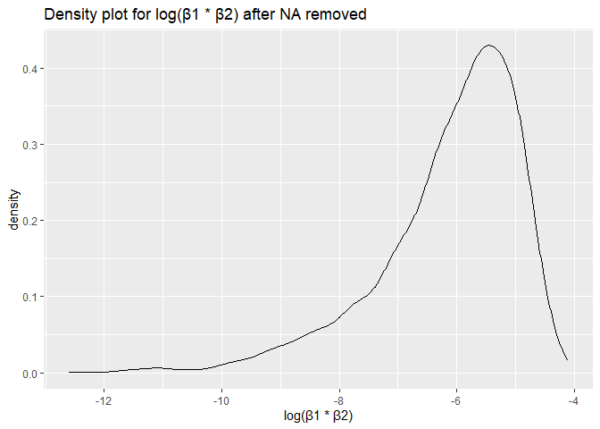
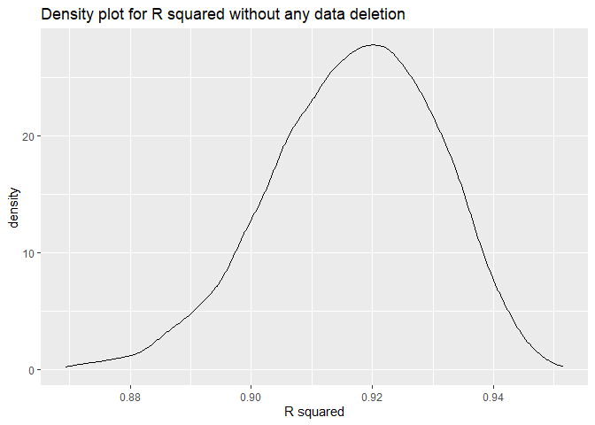

p8105_hw6_cp3384
================
Chenshuo Pan
2023-12-02

# Question1

**Create a city_state variable (e.g. “Baltimore, MD”), and a binary
variable indicating whether the homicide is solved. Omit cities Dallas,
TX; Phoenix, AZ; and Kansas City, MO – these don’t report victim race.
Also omit Tulsa, AL – this is a data entry mistake. For this problem,
limit your analysis those for whom victim_race is white or black. Be
sure that victim_age is numeric.**

``` r
#homicides_data<-read_csv('https://raw.githubusercontent.com/washingtonpost/data-homicides/master/homicide-data.csv')

homicides_data<-read_csv('data/homicide-data.csv')
```

    ## Rows: 52179 Columns: 12
    ## ── Column specification ────────────────────────────────────────────────────────
    ## Delimiter: ","
    ## chr (9): uid, victim_last, victim_first, victim_race, victim_age, victim_sex...
    ## dbl (3): reported_date, lat, lon
    ## 
    ## ℹ Use `spec()` to retrieve the full column specification for this data.
    ## ℹ Specify the column types or set `show_col_types = FALSE` to quiet this message.

``` r
homicide_data_clean<- homicides_data%>%
  mutate(city_state = paste(city,state,sep = ","),
         status = case_when(
           str_detect(disposition,"Open/No arrest") ==TRUE ~0,
           TRUE   ~ 1))%>%
  filter(!(city_state %in% c("Dallas,TX","Phoenix,AZ","Kansas City,MO","Tulsa,AL")))%>%
  filter(victim_race %in%c("White","Black"))%>%
  mutate(victim_age = as.numeric(victim_age))
```

**For the city of Baltimore, MD, use the glm function to fit a logistic
regression with resolved vs unresolved as the outcome and victim age,
sex and race as predictors. Save the output of glm as an R object; apply
the broom::tidy to this object; and obtain the estimate and confidence
interval of the adjusted odds ratio for solving homicides comparing male
victims to female victims keeping all other variables fixed.**

``` r
homicides_baltimore <- homicide_data_clean%>%
  filter(city_state == "Baltimore,MD")%>%
  mutate(victim_race = factor(victim_race))%>%
  mutate(victim_sex = factor(victim_sex))


glm_baltimore = glm(status ~ victim_age + victim_race + victim_sex,data = homicides_baltimore,family = binomial)

broom::tidy(glm_baltimore)
```

    ## # A tibble: 4 × 5
    ##   term             estimate std.error statistic  p.value
    ##   <chr>               <dbl>     <dbl>     <dbl>    <dbl>
    ## 1 (Intercept)       0.664     0.174        3.80 1.42e- 4
    ## 2 victim_age       -0.00520   0.00325     -1.60 1.10e- 1
    ## 3 victim_raceWhite  0.900     0.180        4.99 6.04e- 7
    ## 4 victim_sexMale   -1.04      0.143       -7.26 3.74e-13

``` r
glm_baltimore%>%
  broom::tidy()%>%
  filter(term == "victim_sexMale")%>%
  mutate(OR = exp(estimate),
  LowerCI = exp(estimate - 1.96 * std.error),
  UpperCI = exp(estimate + 1.96 * std.error))
```

    ## # A tibble: 1 × 8
    ##   term           estimate std.error statistic  p.value    OR LowerCI UpperCI
    ##   <chr>             <dbl>     <dbl>     <dbl>    <dbl> <dbl>   <dbl>   <dbl>
    ## 1 victim_sexMale    -1.04     0.143     -7.26 3.74e-13 0.355   0.268   0.469

**Now run glm for each of the cities in your dataset, and extract the
adjusted odds ratio (and CI) for solving homicides comparing male
victims to female victims. Do this within a “tidy” pipeline, making use
of purrr::map, list columns, and unnest as necessary to create a
dataframe with estimated ORs and CIs for each city.**

``` r
result_summary <- homicide_data_clean%>%
  mutate(victim_race = factor(victim_race))%>%
  mutate(victim_sex = factor(victim_sex))%>%
  nest(data = -city_state)%>%
  mutate(models = map(data,\(df) glm(status ~ victim_age + victim_race + victim_sex,data = df,family = binomial)),
         results = map(models, broom::tidy))%>%
  select(-data, -models) %>%
  unnest(results)%>%
  filter(term == "victim_sexMale")%>%
  mutate(OR = exp(estimate),
  LowerCI = exp(estimate - 1.96 * std.error),
  UpperCI = exp(estimate + 1.96 * std.error))%>%
  select(city_state, OR, LowerCI, UpperCI)


result_summary %>%
  ggplot(aes(y = reorder(city_state, OR), x = OR))+
  geom_point() +
  geom_errorbar(aes(xmin = LowerCI, xmax = UpperCI)) +
  labs(title = "Estimated Odds Ratio and Confidence Interval",
       x = "Adjusted Odds Ratio",
       y = "City and State")+
  theme_minimal()
```

<!-- -->

# Question2

``` r
weather_df = 
  rnoaa::meteo_pull_monitors(
    c("USW00094728"),
    var = c("PRCP", "TMIN", "TMAX"), 
    date_min = "2022-01-01",
    date_max = "2022-12-31")%>%
  mutate(
    name = recode(id, USW00094728 = "CentralPark_NY"),
    tmin = tmin / 10,
    tmax = tmax / 10)%>%
  select(name, id, everything())
```

    ## using cached file: C:\Users\Alienware\AppData\Local/R/cache/R/rnoaa/noaa_ghcnd/USW00094728.dly

    ## date created (size, mb): 2023-11-21 15:51:49.130426 (8.561)

    ## file min/max dates: 1869-01-01 / 2023-11-30

**The boostrap is helpful when you’d like to perform inference for a
parameter / value / summary that doesn’t have an easy-to-write-down
distribution in the usual repeated sampling framework. We’ll focus on a
simple linear regression with tmax as the response with tmin and prcp as
the predictors, and are interested in the distribution of two quantities
estimated from these data:**

``` r
#Conduct a bootstrap with a frequency of 5000, and perform regression for each experiment to obtain the parameter coefficients and R square
weather_model <-
  weather_df %>%
  modelr::bootstrap(n = 5000)%>%
  mutate(
    models = map(strap, \(df) lm(tmax ~ tmin + prcp, data = df)),
    results = map(models, broom::tidy),
    glance = map(models, broom::glance)
    )%>%
  select(-strap,-models)

#Find the product of beta1 and beta2 for 5000 bootstraps
#and mutate a variable presents log beta
log_beta_product <-
  weather_model%>%
  unnest(results)%>%
  filter(term != "(Intercept)")%>%
  group_by(.id)%>%
  summarize(beta_hat = prod(estimate))%>%
  mutate(logbeta = log(beta_hat))

#Get the Rsquared
model_rsquare <-
  weather_model%>%
  unnest(glance)%>%
  select(.id,r.squared)
```

``` r
#delete all NA in log beta
log_beta_product_rmNA <- na.omit(log_beta_product)

#join the two tables to keep those rows not NA
beta_R2_rmNA <- left_join(log_beta_product_rmNA,model_rsquare,by = ".id")
```

``` r
#show 95% interval of log beta product
quantile(pull(beta_R2_rmNA,logbeta),prob = c(0.025, 0.975),na.rm = TRUE)%>%
  knitr::kable()
```

|       |         x |
|:------|----------:|
| 2.5%  | -9.202135 |
| 97.5% | -4.594695 |

``` r
#show 95% interval of  R squared after NA deletion
quantile(pull(beta_R2_rmNA,r.squared),prob = c(0.025, 0.975),na.rm = TRUE)%>%
  knitr::kable()
```

|       |         x |
|:------|----------:|
| 2.5%  | 0.8819804 |
| 97.5% | 0.9257604 |

``` r
#show 95% interval of  R squared without NA deletion

quantile(pull(model_rsquare,r.squared),prob = c(0.025, 0.975),na.rm = TRUE)%>%
  knitr::kable()
```

|       |         x |
|:------|----------:|
| 2.5%  | 0.8878449 |
| 97.5% | 0.9407673 |

``` r
# Density plot for log(β1 * β2) after NA removed

beta_R2_rmNA%>%
  ggplot(aes(x = logbeta))+
  geom_density()+
  labs(x = "log(β1 * β2)",
       title = "Density plot for log(β1 * β2) after NA removed")
```

<!-- -->

As can be seen from the shape of the density plot, there is a longer
tail on the left, which proves that there may be outliers and skewed. At
the same time, 95% of the intervals also prove this. The most densely
distributed area is around -5.5，

``` r
#Density plot for R squared after NA removed
beta_R2_rmNA%>%
  ggplot(aes(x = r.squared))+
  geom_density()+
  labs(x = "R Squared",
       title = "Density plot for R squared after NA removed")
```

<!-- -->

Compared with the image of log(beta), the distribution of R Squared is
more approximately normal and has no obvious skewness. From the X-axis
scale, basically all results are acceptable for the R2 standard, which
means that the model we use is appropriate.

``` r
#Density plot for R squared without any data deletion
model_rsquare%>%
  ggplot(aes(x = r.squared))+
  geom_density()+
  labs(x = "R squared",
       title = "Density plot for R squared without any data deletion")
```

<!-- -->

Compared with the previous picture: R2 with NA data removed. The two
pictures are similar in shape, but the overall graph has moved to the
right. This can also be seen from the 95% interval we constructed. The
97.5% value without processing is greater than the 97.5% value with NA
removed.

# Question3

**Load and clean the data for regression analysis (i.e. convert numeric
to factor where appropriate, check for missing data, etc.).**

``` r
birthweight <- read_csv("data/birthweight.csv")%>%
  janitor::clean_names()%>%
  mutate(babysex = factor(case_when(babysex == 1 ~ "male",
                             TRUE ~ "female")),
         
         frace = factor(case_when(frace == 1 ~ "White",
                           frace == 2 ~ "Black",
                           frace == 3 ~ "Asian",
                           frace == 4 ~ "Puerto Rican",
                           frace == 8 ~ "Other",
                           frace == 9 ~ "Unknown")),
         
         malform = factor(case_when(malform == 0 ~ "absent",
                             TRUE ~ "present")),
         
         mrace = factor(case_when(mrace == 1 ~ "White",
                           mrace == 2 ~ "Black",
                           mrace == 3 ~ "Asian",
                           mrace == 4 ~ "Puerto Rican",
                           mrace == 8 ~ "Other")))%>%
  mutate(frace = fct_infreq(frace),
         mrace = fct_infreq(mrace))
```

    ## Rows: 4342 Columns: 20
    ## ── Column specification ────────────────────────────────────────────────────────
    ## Delimiter: ","
    ## dbl (20): babysex, bhead, blength, bwt, delwt, fincome, frace, gaweeks, malf...
    ## 
    ## ℹ Use `spec()` to retrieve the full column specification for this data.
    ## ℹ Specify the column types or set `show_col_types = FALSE` to quiet this message.

``` r
# check for missing data
sum(is.na(birthweight))
```

    ## [1] 0

There are no missing data in this dataset, and for each categorical
variable, I numerically converted them into meaningful factors

**Propose a regression model for birthweight. This model may be based on
a hypothesized structure for the factors that underly birthweight, on a
data-driven model-building process, or a combination of the two.
Describe your modeling process and show a plot of model residuals
against fitted values – use add_predictions and add_residuals in making
this plot.**

``` r
# propose a full model
hypo_model = lm(bwt~ ., data = birthweight)
# do stepwise regression
bothward_model <- step(hypo_model, direction = "both",trace = 0)
summary(bothward_model)
```

    ## 
    ## Call:
    ## lm(formula = bwt ~ babysex + bhead + blength + delwt + fincome + 
    ##     gaweeks + mheight + mrace + parity + ppwt + smoken, data = birthweight)
    ## 
    ## Residuals:
    ##      Min       1Q   Median       3Q      Max 
    ## -1097.18  -185.52    -3.39   174.14  2353.44 
    ## 
    ## Coefficients:
    ##                     Estimate Std. Error t value Pr(>|t|)    
    ## (Intercept)       -6070.2639   136.9081 -44.338  < 2e-16 ***
    ## babysexmale         -28.5580     8.4549  -3.378 0.000737 ***
    ## bhead               130.7770     3.4466  37.944  < 2e-16 ***
    ## blength              74.9471     2.0190  37.120  < 2e-16 ***
    ## delwt                 4.1067     0.3921  10.475  < 2e-16 ***
    ## fincome               0.3180     0.1747   1.820 0.068844 .  
    ## gaweeks              11.5925     1.4621   7.929 2.79e-15 ***
    ## mheight               6.5940     1.7849   3.694 0.000223 ***
    ## mraceBlack         -138.7925     9.9071 -14.009  < 2e-16 ***
    ## mracePuerto Rican  -100.6781    19.3247  -5.210 1.98e-07 ***
    ## mraceAsian          -74.8868    42.3146  -1.770 0.076837 .  
    ## parity               96.3047    40.3362   2.388 0.017004 *  
    ## ppwt                 -2.6756     0.4274  -6.261 4.20e-10 ***
    ## smoken               -4.8434     0.5856  -8.271  < 2e-16 ***
    ## ---
    ## Signif. codes:  0 '***' 0.001 '**' 0.01 '*' 0.05 '.' 0.1 ' ' 1
    ## 
    ## Residual standard error: 272.3 on 4328 degrees of freedom
    ## Multiple R-squared:  0.7181, Adjusted R-squared:  0.7173 
    ## F-statistic: 848.1 on 13 and 4328 DF,  p-value: < 2.2e-16

I first use a complete model, that is, a model that includes all main
variables. Then I use Stepwise Regression with both directions to help
me get a model. on the basis of,I only keep those very significant
predictors.

``` r
#Retain only significant variables in the above model
proposed_model = lm(bwt ~  babysex + blength + delwt + gaweeks + mheight + mrace + ppwt +smoken, data = birthweight)

summary(proposed_model)
```

    ## 
    ## Call:
    ## lm(formula = bwt ~ babysex + blength + delwt + gaweeks + mheight + 
    ##     mrace + ppwt + smoken, data = birthweight)
    ## 
    ## Residuals:
    ##     Min      1Q  Median      3Q     Max 
    ## -1665.1  -208.7    -5.3   202.1  3677.7 
    ## 
    ## Coefficients:
    ##                     Estimate Std. Error t value Pr(>|t|)    
    ## (Intercept)       -4220.9457   147.9603 -28.528  < 2e-16 ***
    ## babysexmale          20.6095     9.6534   2.135 0.032821 *  
    ## blength             115.0705     1.9846  57.981  < 2e-16 ***
    ## delwt                 5.3097     0.4514  11.762  < 2e-16 ***
    ## gaweeks              22.8241     1.6481  13.849  < 2e-16 ***
    ## mheight               6.8940     2.0565   3.352 0.000808 ***
    ## mraceBlack         -183.3331    10.6002 -17.295  < 2e-16 ***
    ## mracePuerto Rican   -82.6732    22.0706  -3.746 0.000182 ***
    ## mraceAsian          -72.9632    48.8778  -1.493 0.135571    
    ## ppwt                 -3.2243     0.4934  -6.535  7.1e-11 ***
    ## smoken               -6.3850     0.6751  -9.457  < 2e-16 ***
    ## ---
    ## Signif. codes:  0 '***' 0.001 '**' 0.01 '*' 0.05 '.' 0.1 ' ' 1
    ## 
    ## Residual standard error: 314.8 on 4331 degrees of freedom
    ## Multiple R-squared:  0.623,  Adjusted R-squared:  0.6221 
    ## F-statistic: 715.7 on 10 and 4331 DF,  p-value: < 2.2e-16

``` r
#Build predicted values and residual plots through the model I proposed, and get the fitting curve through smooth

birthweight%>%
  add_predictions(proposed_model)%>%
  add_residuals(proposed_model)%>%
  ggplot(aes(x = pred, y = resid))+
  geom_point()+
  stat_smooth(method = "lm")
```

    ## `geom_smooth()` using formula = 'y ~ x'

<!-- -->

As you can see, my fitted curve `smooth()` basically floats around 0,
which proves that there is no obvious pattern for different predicted
values. So from this perspective, the model I proposed has better
fitting ability

**Compare your model to two others:One using length at birth and
gestational age as predictors (main effects only),One using head
circumference, length, sex, and all interactions (including the
three-way interaction) between these Make this comparison in terms of
the cross-validated prediction error; use crossv_mc and functions in
purrr as appropriate.**

``` r
# build main model
main_model <-lm(bwt ~ blength +gaweeks, data = birthweight)
# build model with interaction
inter_model <-lm(bwt ~ bhead + blength +babysex + babysex*bhead*blength, data = birthweight)
```

``` r
# separate the test set and training set for cross validation
cv_df = 
  crossv_mc(birthweight, 100) %>%
  mutate(
    train = map(train, as_tibble),
    test = map(test, as_tibble))
# do calculation for mse of each set
cv_df = 
  cv_df %>%
  mutate(
    proposed_mod  = map(train, ~proposed_model),
    main_mod  = map(train, ~main_model),
    inter_mod  = map(train, ~inter_model))%>%
  mutate(
    rmse_proposed = map2_dbl(proposed_mod, test, \(mod, df) rmse(model = mod, data = df)),
    rmse_main = map2_dbl(main_mod, test, \(mod, df) rmse(model = mod, data = df)),
    rmse_inter = map2_dbl(inter_mod, test, \(mod, df) rmse(model = mod, data = df)))


cv_df %>% 
  select(starts_with("rmse")) %>% 
  pivot_longer(
    everything(),
    names_to = "model", 
    values_to = "rmse",
    names_prefix = "rmse_") %>% 
  mutate(model = fct_inorder(model)) %>% 
  ggplot(aes(x = model, y = rmse)) + geom_violin()+
  labs(title =" violin plot of distribution of RMSE values for each candidate model. ")
```

<!-- -->

The plot above shows the distribution of RMSE values for each candidate
model.

By comparing the three models, the Intersection model has the smallest
RMSE distribution, which proves that the RMSE model performs best in
this data set among the three models, and the main model with only main
effects performs the worst, which may be too simple.
